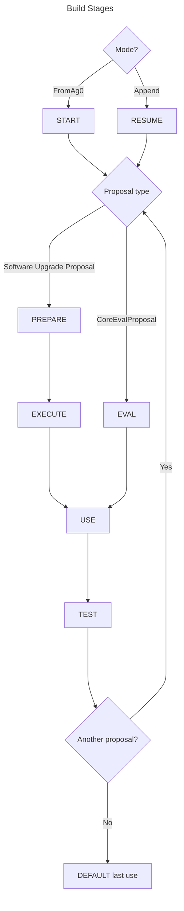

# Synthetic chain tools

Utilities to build a synthetic chain and test running proposals atop it. The chain approximates agoric-3 (Mainnet) using the state from https://github.com/Agoric/agoric-3-proposals (It could trivially support other Agoric chains, if we scale horizontally.)

```sh
node_modules/.bin/synthetic-chain build

node_modules/.bin/synthetic-chain test

node_modules/.bin/synthetic-chain test --debug -m <substring of proposal name>
```

## Design

It builds images starting from ag0 or an already build synthetic-chain. The build stages sequence is produced by `dockerfileGen.ts` approximately as so:



## Development

To depend on `@agoric/synthetic-chain` that isn't yet published, use `npm pack` in this package and copy the tgz into the proposal. Then use the `file:` protocol in the package.json to add it. Finally `yarn install` in the package to update local node_modules for linting. E.g.,

```json
    "dependencies": {
        "@agoric/synthetic-chain": "file:agoric-synthetic-chain-0.0.1-alpha.tgz",
```

### Debugging proposals

The build will fail if an upgrade proposal fails but a CoreEval has no
completion condition the build can wait for. Your TEST stage needs to look for
the effects you expect the CoreEval to cause. If it doesn't, try looking in the
logs around `PROPOSAL_STATUS_PASSED` to see if there were any errors. Because
Docker CLI scrolls the output in a small viewport, you may need to get the full
logs. An easy way to do this in Docker Desktop is enabling “Turn on the Builds
view” in Docker Desktop settings under “Features in development”. Then look at
the Logs tab for the build in question.
